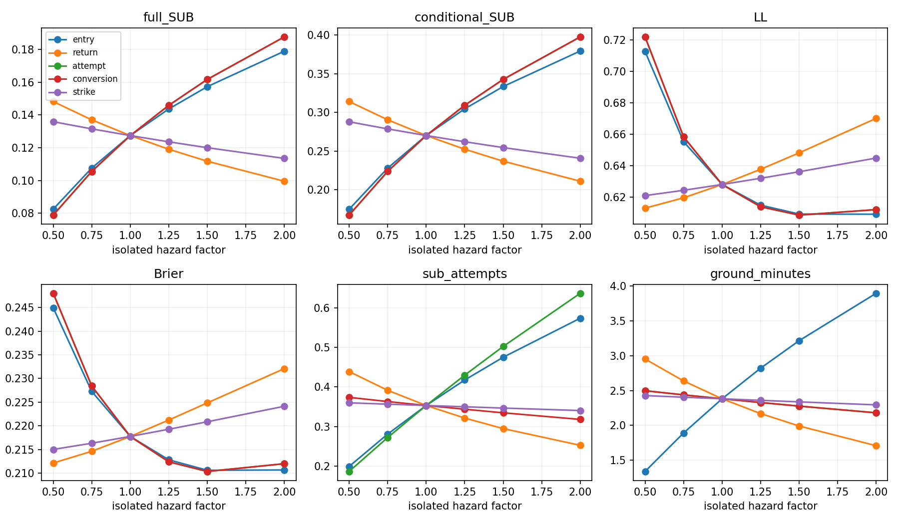
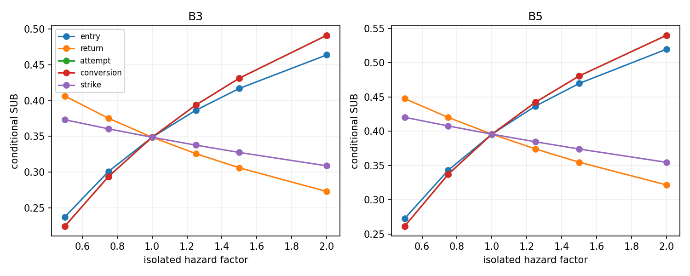

# Hazard sensitivity curves

Five independent six-point sweeps; factor1 reproduces primary. No combinations or winner. Conversion scaling is terminal hazard scaling and must not be read as a new calibrated probability. Attempt and conversion terminal curves overlap exactly; nonconverting attempts differ. All subgroup/annual metrics are in diagnostic_summary.csv.

| diagnostic | LL | Brier | full_SUB | conditional_SUB |
| --- | --- | --- | --- | --- |
| primary | 0.627949 | 0.217752 | 0.127442 | 0.270067 |
| return_half | 0.612866 | 0.212130 | 0.148240 | 0.314020 |
| return_double | 0.670128 | 0.232101 | 0.099534 | 0.211109 |
| entry_0.5 | 0.712788 | 0.244961 | 0.082484 | 0.174867 |
| entry_0.75 | 0.655247 | 0.227270 | 0.107569 | 0.227986 |
| entry_1 | 0.627949 | 0.217752 | 0.127442 | 0.270067 |
| entry_1.25 | 0.614759 | 0.212808 | 0.143708 | 0.304513 |
| entry_1.5 | 0.609090 | 0.210597 | 0.157336 | 0.333372 |
| entry_2 | 0.608997 | 0.210659 | 0.179000 | 0.379252 |
| return_0.5 | 0.612866 | 0.212130 | 0.148240 | 0.314020 |
| return_0.75 | 0.619445 | 0.214614 | 0.137062 | 0.290394 |
| return_1 | 0.627949 | 0.217752 | 0.127442 | 0.270067 |
| return_1.25 | 0.637663 | 0.221228 | 0.119083 | 0.252408 |
| return_1.5 | 0.648122 | 0.224850 | 0.111758 | 0.236933 |
| return_2 | 0.670128 | 0.232101 | 0.099534 | 0.211109 |
| attempt_0.5 | 0.722088 | 0.248036 | 0.078858 | 0.167360 |
| attempt_0.75 | 0.658340 | 0.228423 | 0.105523 | 0.223746 |
| attempt_1 | 0.627949 | 0.217752 | 0.127442 | 0.270067 |
| attempt_1.25 | 0.613719 | 0.212387 | 0.145916 | 0.309094 |
| attempt_1.5 | 0.608437 | 0.210345 | 0.161777 | 0.342594 |
| attempt_2 | 0.611927 | 0.211987 | 0.187760 | 0.397467 |
| conversion_0.5 | 0.722088 | 0.248036 | 0.078858 | 0.167360 |
| conversion_0.75 | 0.658340 | 0.228423 | 0.105523 | 0.223746 |
| conversion_1 | 0.627949 | 0.217752 | 0.127442 | 0.270067 |
| conversion_1.25 | 0.613719 | 0.212387 | 0.145916 | 0.309094 |
| conversion_1.5 | 0.608437 | 0.210345 | 0.161777 | 0.342594 |
| conversion_2 | 0.611927 | 0.211987 | 0.187760 | 0.397467 |
| strike_0.5 | 0.620855 | 0.215004 | 0.135905 | 0.287826 |
| strike_0.75 | 0.624239 | 0.216318 | 0.131527 | 0.278642 |
| strike_1 | 0.627949 | 0.217752 | 0.127442 | 0.270067 |
| strike_1.25 | 0.631913 | 0.219273 | 0.123620 | 0.262037 |
| strike_1.5 | 0.636073 | 0.220856 | 0.120035 | 0.254500 |
| strike_2 | 0.644816 | 0.224134 | 0.113489 | 0.240723 |

Diagnostic only. No constants selected, replacement model trained, frozen definitions changed, prospective outcomes accessed or promotion authorized.
